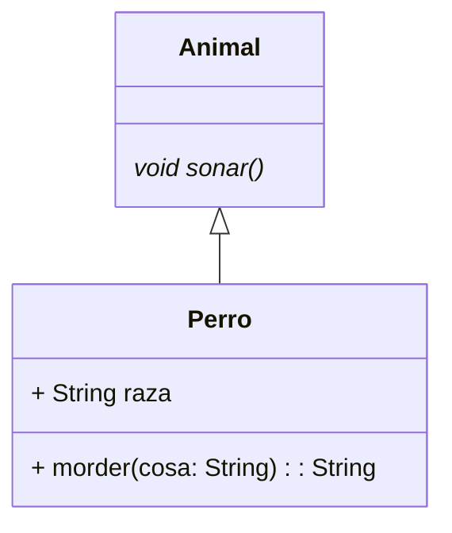

# Diagramas de classes
  ## Animales
  
  El siguiente diagrama representa la estrucutura de classes de los tipos de animales de la aplicación.


```java

class perro extends Animal{

    String raza;
    
    String morder(String cosa) {
        return null;
    }
  
  @Override
  void sonar() {
  }
  

}

abstarct class Animal  {

  void alimentar() {
  
  }
  abstract void sonar();
}

```

